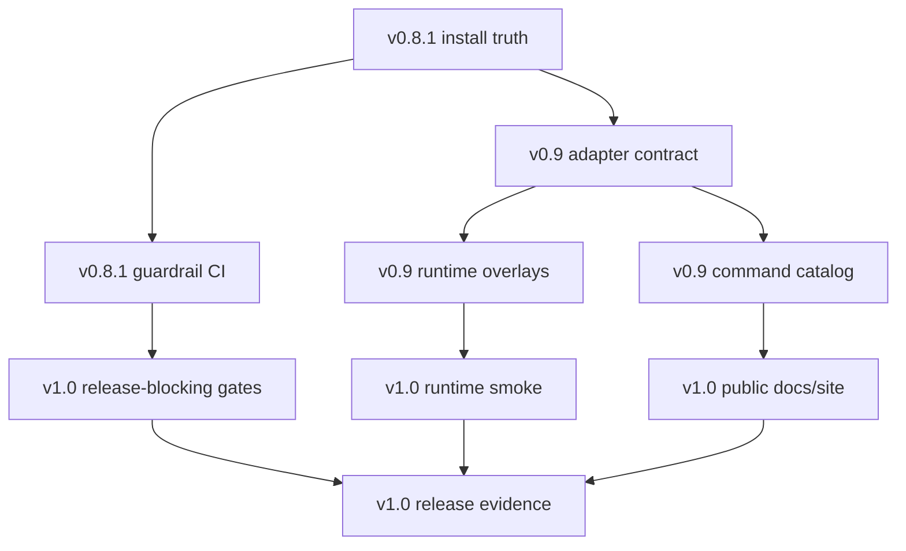

# Implementation Plan: ADD Plugin Family Release Hardening

**Spec:** `specs/plugin-family-release-hardening.md`
**Target Releases:** v0.8.1, v0.9.0, v1.0.0
**Status:** Draft
**Created:** 2026-04-23
**Source Review:** Five-swarm ADD plugin review, April 2026

## Scope

This plan turns the aggregated review findings into a three-release roadmap. The work is intentionally staged:

1. **v0.8.1 hotfix:** unblock users and close the highest-risk guardrail bypass.
2. **v0.9.0 architecture:** make ADD a real plugin family with runtime contracts instead of ad hoc translations.
3. **v1.0.0 confidence:** prove install, runtime behavior, and safety claims end to end.

## Swarm Aggregate Summary

| Theme | Consensus | Release |
|-------|-----------|---------|
| Distribution validity | Claude marketplace validation fails; Codex packaging is not yet proven against the current CLI. | v0.8.1, v0.9.0 |
| Installed asset paths | Codex generated skills and installer disagree on where shared assets live. | v0.8.1 |
| Safety controls | Test rewrite approval can be bypassed; telemetry/secrets/security controls need operational proof. | v0.8.1, v0.9.0 |
| Runtime architecture | `core/` is still Claude-shaped; adapters are descriptive rather than authoritative. | v0.9.0 |
| Docs and catalog | README, marketplace counts, command syntax, version markers, and website/report assets have drifted. | v0.8.1, v0.9.0, v1.0.0 |
| CI proof | Local tests exist but are not consistently release-blocking, and runtime install smoke is missing. | v0.8.1, v1.0.0 |

## Release 1: v0.8.1 Hotfix

### Goal

Make the current release safe to install and honest to use. This release should not attempt a full kernel extraction; it should fix the broken surfaces users encounter first.

### Deliverables

| Task | AC | Files | Notes |
|------|----|-------|-------|
| TASK-001: Fix Claude marketplace schema | AC-001 | `.claude-plugin/marketplace.json` | Move invalid top-level fields into the schema-supported location and validate locally. |
| TASK-002: Add marketplace validation to CI/release | AC-001, AC-009 | `.github/workflows/*`, `scripts/release.sh` | Run `claude plugin validate .` and `claude plugin validate plugins/add`. |
| TASK-003: Choose canonical Codex ADD root | AC-002 | `runtimes/codex/adapter.yaml`, `scripts/compile.py`, `scripts/install-codex.sh` | Prefer `$CODEX_HOME/add` for shared plugin-owned assets unless Codex plugin-relative packaging supersedes it. |
| TASK-004: Rewrite Codex path substitutions | AC-002 | `scripts/compile.py`, generated `dist/codex/.agents/skills/*` | Replace `~/.codex/templates` style references with the canonical ADD root. |
| TASK-005: Install all referenced Codex assets | AC-002, AC-003 | `scripts/install-codex.sh`, `dist/codex/` | Include templates, knowledge, rules, lib, security, scripts/helpers, manifests, and VERSION. |
| TASK-006: Add temp-home installer path smoke | AC-003, AC-009 | `tests/codex-install/` | Use temp `CODEX_HOME`; scan installed skills for unresolved plugin-owned paths. |
| TASK-007: Patch test rewrite approval bypass | AC-004 | `scripts/check-test-count.py`, `tests/test-deletion-guardrail/` | `--allow-test-rewrite` should enable the approval path, not replace approval. |
| TASK-008: Update Codex README/install docs | AC-005 | `README.md`, `docs/codex-install.md`, `dist/codex/README.md` | State native skills, sub-agents, hooks, and pinned minimum version. |
| TASK-009: Fix Claude rule parity | AC-006 | `core/skills/init/SKILL.md`, `runtimes/claude/CLAUDE.md`, tests | Generate or parity-check rule lists from `core/rules/*.md`. |
| TASK-010: Surface prompt-injection warnings | AC-007 | `runtimes/claude/hooks/posttooluse-scan.sh`, tests | Use the documented Claude-visible hook feedback channel or downgrade claims. |
| TASK-011: Guard or document `jq` dependency | AC-008 | `runtimes/claude/hooks/*`, `README.md`, docs | Either fail soft when absent or declare dependency accurately. |
| TASK-012: Make guardrail suites run in CI | AC-009 | `.github/workflows/guardrails.yml` | Run existing shell suites plus compile/frontmatter checks. |

### Exit Criteria

- `claude plugin validate .` passes.
- `claude plugin validate plugins/add` passes.
- `python3 scripts/compile.py --check` passes.
- Full local guardrail shell suite passes in CI.
- Codex temp-home installer smoke passes.
- Test rewrite without override fails even with `--allow-test-rewrite`.
- Worktree after compile is clean.

### Parallelization

These work streams are mostly independent:

- Claude marketplace and CI validation.
- Codex install path fix and temp-home smoke.
- Test rewrite guardrail patch.
- Docs update and command/version count cleanup.
- Hook feedback and `jq` dependency cleanup.

## Release 2: v0.9.0 Runtime Architecture

### Goal

Turn ADD from "Claude plugin plus Codex translation" into a runtime family: one host-neutral methodology kernel, runtime overlays, and adapter contracts that compile/install can trust.

### Deliverables

| Task | AC | Files | Notes |
|------|----|-------|-------|
| TASK-101: Define adapter contract schema | AC-010 | `core/schemas/adapter.schema.json`, `runtimes/*/adapter.yaml` | Include output roots, install roots, assets, path variables, hooks, agents, manifests, docs. |
| TASK-102: Make compiler consume adapter contract | AC-010 | `scripts/compile.py` | Remove hard-coded runtime output decisions where practical; add drift assertions for remaining exceptions. |
| TASK-103: Introduce neutral ADD path variables | AC-011 | `core/skills/*`, `core/rules/*`, `runtimes/*/adapter.yaml` | Add `${ADD_HOME}`, `${ADD_USER_LIBRARY}`, `${ADD_RUNTIME_ROOT}`. |
| TASK-104: Add runtime overlays | AC-012 | `runtimes/claude/overlays/`, `runtimes/codex/overlays/`, `scripts/compile.py` | Overlay command syntax, docs, project file names, tool names, storage paths. |
| TASK-105: Clean Codex output of unapproved Claude terms | AC-012 | generated `dist/codex/.agents/skills/*`, tests | Allow intentional interoperability notes only. |
| TASK-106: Resolve Codex packaging format | AC-013 | `dist/codex/`, `.codex-plugin/`, `.agents/plugins/` | Match pinned Codex CLI conventions; update spec if `plugin.toml` remains transitional. |
| TASK-107: Validate Codex skill policy metadata | AC-014 | `runtimes/codex/skill-policy.yaml`, `scripts/compile.py`, tests | Emit the correct `agents/openai.yaml` shape and validate explicit-only skills. |
| TASK-108: Fix Codex hooks/config enablement | AC-015 | `dist/codex/.codex/hooks.json`, `scripts/install-codex.sh`, manifests | Decide plugin-relative vs safe global merge; test both expected install path and user messaging. |
| TASK-109: Add installer ownership manifest | AC-016 | `scripts/install-codex.sh`, `dist/codex/ownership.json` | Backup overwritten files; namespace agents; support `--dry-run`; uninstall only owned files. |
| TASK-110: Add config schema and migration graph tests | AC-017 | `core/schemas/config.schema.json`, `core/templates/migrations.json`, tests | Prove all supported versions migrate to `core/VERSION`. |
| TASK-111: Implement telemetry writer | AC-018 | `core/lib/`, `core/skills/*`, tests | Shared helper or generated post-flight block; emit success/failure/abort/partial. |
| TASK-112: Implement executable secrets scanner | AC-019 | `core/lib/`, `core/skills/deploy/SKILL.md`, `core/skills/verify/SKILL.md`, tests | Read shared catalog, respect `.secretsignore`, redact values, block staged leaks. |
| TASK-113: Make cache strict mode enforceable | AC-020 | `core/skills/*`, `scripts/validate-cache-discipline.py` | Fix false positives or add explicit markers/suppressions. |
| TASK-114: Generate command catalog | AC-021 | `scripts/generate-command-catalog.py`, `docs/`, runtime docs, marketplace metadata | Single source for counts, syntax, risk, dispatch, write behavior. |

### Exit Criteria

- Adapter schema validates for Claude and Codex.
- Compile output follows adapter contracts or reports a precise mismatch.
- Generated Codex skills have no unapproved Claude-specific paths, commands, or project-file instructions.
- Config schema validates generated `.add/config.json`.
- Migration graph test covers every supported release version.
- Telemetry and secrets controls are operational in fixture/smoke tests.
- Command catalog regenerates docs/metadata consistently.

### Parallelization

Use disjoint worker lanes:

- Adapter schema and compiler contract.
- Runtime overlays and neutral path variables.
- Codex packaging/policy/hooks.
- Installer ownership.
- Config/migration validation.
- Telemetry/secrets/cache controls.
- Command catalog/docs generation.

## Release 3: v1.0.0 Release Confidence

### Goal

Make the public claim defensible: ADD installs, runs, and enforces its methodology across supported runtimes with release evidence attached.

### Deliverables

| Task | AC | Files | Notes |
|------|----|-------|-------|
| TASK-201: Add Claude install smoke | AC-022 | `.github/workflows/runtime-smoke.yml`, test fixtures | Validate marketplace, install plugin, discover representative commands/skills. |
| TASK-202: Add Codex install smoke | AC-023 | `.github/workflows/runtime-smoke.yml`, test fixtures | Marketplace/plugin install, skill discovery, explicit-only blocking, agents, hooks, dry workflow. |
| TASK-203: Promote guardrail tests to release-blocking | AC-024 | `.github/workflows/guardrails.yml`, branch protection docs | Include security, secrets, telemetry, cache, test-deletion, migration, command catalog, AGENTS sync. |
| TASK-204: Produce release evidence bundle | AC-025 | `docs/releases/`, `scripts/release-evidence.sh` | Runtime matrix, known limitations, smoke outputs, command catalog, version map, migration coverage. |
| TASK-205: Regenerate public docs and site inputs | AC-026 | `README.md`, `docs/`, `reports/`, website input files | Archive stale reports or mark as historical. |
| TASK-206: Calibrate runtime security claims | AC-027 | `SECURITY.md`, `docs/`, runtime READMEs | List exact hook feedback guarantees per runtime and limitations. |
| TASK-207: Replace mutable public install path | AC-028 | `scripts/install-codex.sh`, docs, release notes | Prefer tag-pinned URL, checksum, signed tag, or plugin marketplace path over `curl main | bash`. |

### Exit Criteria

- Supported Claude and Codex versions are pinned and tested.
- Release branch cannot pass without runtime smoke and guardrail gates.
- Release evidence bundle is generated and attached to the release/tag.
- Public docs match generated catalog and runtime evidence.
- Known limitations are explicit, not hidden in implementation notes.

## Cross-Release Dependency Graph



## Validation Commands

Run these during implementation:

```bash
claude plugin validate .
claude plugin validate plugins/add
python3 scripts/validate-frontmatter.py
python3 scripts/compile.py --check
bash tests/compile/test-compile-codex.sh
bash tests/codex-native-skills/test-codex-native-skills.sh
bash tests/security/test-prompt-injection-defense.sh
bash tests/secrets-handling/test-secrets-handling.sh
bash tests/test-deletion-guardrail/test-test-deletion-guardrail.sh
bash tests/cache-discipline/test-cache-discipline.sh
bash tests/agents-md-sync/test-agents-md-sync.sh
bash tests/hooks/test-filter-learnings.sh
bash tests/telemetry-jsonl/test-telemetry-jsonl.sh
```

Add these as new tests:

```bash
bash tests/codex-install/test-install-paths.sh
bash tests/runtime-contract/test-adapter-contract.sh
bash tests/config/test-migration-graph.sh
bash tests/catalog/test-command-catalog-drift.sh
bash tests/runtime-smoke/test-claude-install.sh
bash tests/runtime-smoke/test-codex-install.sh
```

## Risk Register

| Risk | Impact | Mitigation |
|------|--------|------------|
| Codex plugin marketplace schema is still evolving. | v0.9 packaging may churn. | Pin CLI version, isolate schema in adapter contract, and keep a transition path from current installer. |
| Host-neutral core extraction touches many skills. | Regression risk and review fatigue. | Start with path variables and generated overlays; avoid hand-editing semantics until tests cover outputs. |
| Runtime smoke tests are flaky in CI. | Release blockers become noisy. | Separate fast structural CI from release smoke, cache host CLIs, and preserve logs as release evidence. |
| Docs/catalog generation overfits current commands. | Future plugin family packages drift again. | Treat command catalog as source-of-truth metadata consumed by docs, marketplace, and runtime manifests. |
| Security claims vary by runtime. | Users assume parity that does not exist. | Publish a runtime capability matrix and fail release if claims exceed tested behavior. |

## Suggested Ownership

| Lane | Owner Type | Scope |
|------|------------|-------|
| Distribution | Release/platform | Claude marketplace, Codex installer, pinned install docs. |
| Runtime contracts | Architecture | Adapter schema, compiler contract, path variables, overlays. |
| Codex native | Codex runtime | Plugin packaging, skill policy, hooks/config, temp-home smoke. |
| Claude runtime | Claude runtime | Marketplace schema, rule parity, hook feedback, tool-name drift. |
| Guardrails | Security/ops | Test rewrite, secrets, telemetry, injection, cache, CI gates. |
| Product/docs | Adoption/docs | README, command catalog, website/report refresh, release evidence. |

## First Implementation Slice

Start with the smallest user-visible hotfix batch:

1. Fix `.claude-plugin/marketplace.json` and add validation to CI.
2. Patch `check-test-count.py` replacement approval logic and add the bypass fixture.
3. Fix Codex shared asset root and add temp-home install path smoke.
4. Update README/Codex docs to remove legacy prompt language.
5. Add the guardrail workflow running the existing shell suites.

This gives v0.8.1 a crisp story: installs are valid, Codex paths resolve, the most severe TDD guardrail bypass is closed, and the tests that already exist now protect releases.

