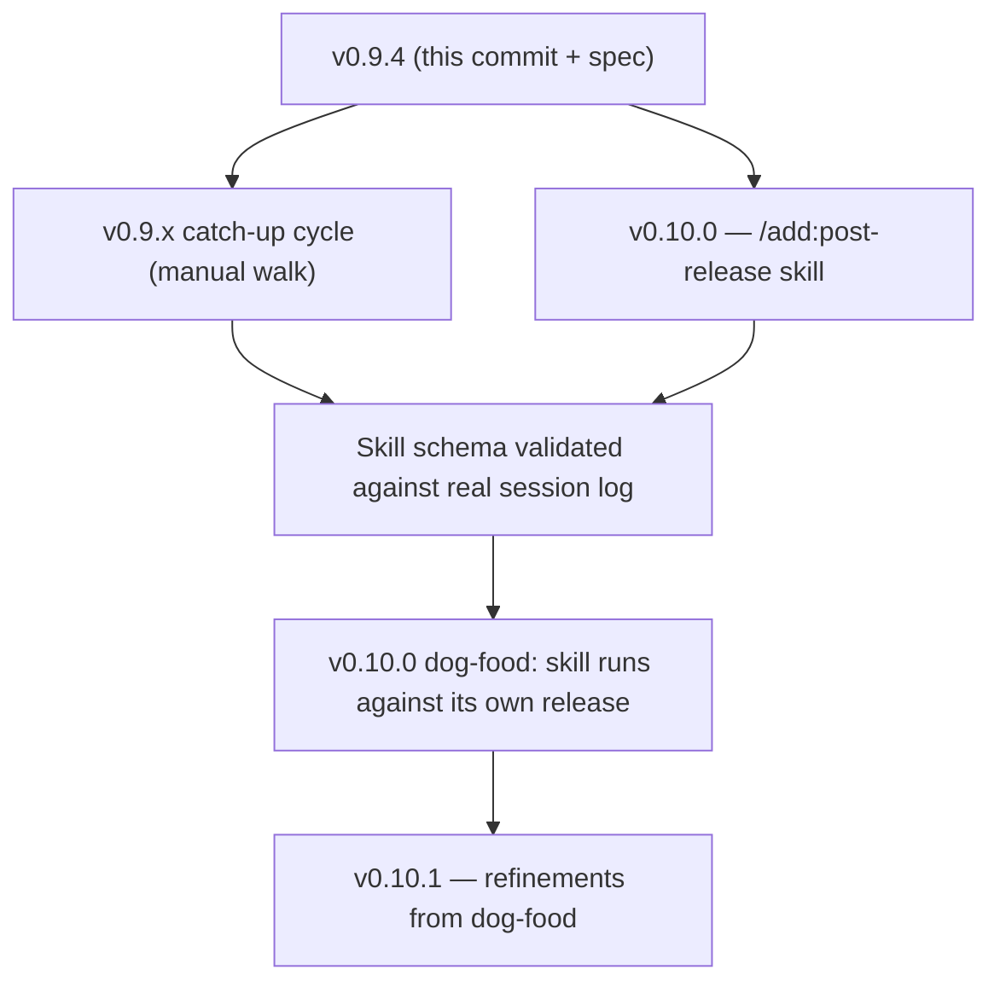

# Implementation Plan: Post-Release Publication Skill

**Spec:** [`specs/post-release-publication.md`](../../specs/post-release-publication.md)
**Target Release:** v0.10.0
**Status:** Draft
**Created:** 2026-04-27

## Scope

Two coordinated deliverables:

1. **The checklist file** (`docs/release-materials.md`) — landed alongside this plan so the format is real, parseable, and dog-foodable from day one. The skill in deliverable #2 is an executor; this is the data.
2. **The `/add:post-release` skill** — reads the checklist, walks it filtered by release type, runs auto/semi-auto items, prompts on manual items, writes a session log.

The first deliverable lands in the same commit as this plan + spec (a doc-only commit). The skill is the v0.10.0 work.

## Context — what triggered this

We've shipped four releases this week (v0.8.1 → v0.9.4) plus three minors / hotfixes earlier in April. At each one, post-release work was incomplete:

- **v0.9.0** shipped without the website blog post on day 1 (added 2026-04-23 evening).
- **v0.9.1, v0.9.2** shipped without separate blog coverage; users see them only on the GitHub releases page.
- **v0.9.3** had a stale social-preview pill (`v0.8 · signed`) until the user flagged it; PNG re-upload to GitHub Settings is still pending as of writing.
- **v0.9.0 → v0.9.3** all silently skipped `core/templates/migrations.json` updates, surfacing only when a v0.5.0 user updated to v0.9.3 and Claude reported the manifest gap. Patched in v0.9.4.
- **CONTRIBUTORS.md** was not promptly updated for some community work.

The maintainer remembers most of these things some of the time. A checklist + skill removes the "remember" tax.

## Cycle for the FIRST execution

Before the v0.10.0 skill exists, the v0.9.x ARC needs catch-up post-release work executed manually against the new `docs/release-materials.md`. That catch-up cycle is the validation that the checklist captures real work.

- **Cycle name:** `cycle-postrelease-v0.9.x`
- **Artifact:** `.add/cycles/cycle-postrelease-v0.9.x.md` (created via `/add:cycle` when execution begins)
- **Scope:** walk `docs/release-materials.md` against the v0.9.0–v0.9.4 cumulative state, capture deltas, fix what's stale.
- **Outcome:** clean state going into v0.10 + a real session log that informs the spec's session-log schema.

This cycle does NOT block the v0.10 skill spec from being approved — they run in parallel.

## Phased delivery for the v0.10 skill

### Phase 1 — Format & parser (RED + GREEN, 0.5 day)

- Write `tests/post-release/test-checklist-parser.sh` with synthetic `release-materials.md` fixtures (clean / malformed item / missing automation marker / new section).
- Build the parser as embedded shell + python in the skill body. Output: a JSONL stream of `{section, title, files, automation, why}` per item.
- Phase 1 exit: parser reads the real `docs/release-materials.md` and emits one line per item.

### Phase 2 — Walker + auto/semi-auto execution (1 day)

- Walk the parsed stream filtered by release-type matrix.
- For `auto` items: execute, capture exit code + stderr, mark `done` or `failed`.
- For `semi-auto` items: print the command, prompt `run? [Y/n]`, execute on Y.
- For `manual` items: print the description + file paths, prompt `done | skip | defer`, log accordingly.
- Telemetry per `core/rules/telemetry.md` emitted at start + end of run.

### Phase 3 — Session log + idempotency (0.5 day)

- `.add/post-release-logs/release-vX.Y.Z.md` written incrementally (each completed item flushes a line so a Ctrl-C doesn't lose state).
- Re-run reads the log, identifies completed items, skips them on the next walk.
- `--resume` flag explicit; default behavior is "resume if log exists."

### Phase 4 — Cross-runtime + integration tests (0.5 day)

- Claude Code: native; Codex CLI: dispatched via `/add-post-release`. Both produce identical session logs.
- Run against a synthetic v0.9.5 tag in a sandbox to validate end-to-end.
- Verify the v0.9.x catch-up cycle's session log validates against the new schema.

### Phase 5 — Docs + dog-fooding (0.5 day)

- Add an entry to maintainer memory's Version Bump Checklist pointing at the post-release skill.
- Update `core/knowledge/global.md` if appropriate (Tier-1 visibility of "post-release work is gated by `docs/release-materials.md`").
- Run `/add:post-release v0.10.0` against this very release as the first dog-food.

## Deliverable detail

### `docs/release-materials.md` (this commit)

- Four sections (A. GitHub & repo hygiene / B. README & guides / C. getadd.dev / D. Contributors)
- Format conventions section (skill-friendly bullet shape per item)
- Release-type matrix at the bottom
- Open follow-ups list (carry-forward candidates)
- Lives in `docs/` because it's a maintainer-facing reference doc, mirrors `docs/release-signing.md`'s positioning.

### `specs/post-release-publication.md` (this commit)

- Full ADD spec with 32 ACs across four sections (checklist file, skill, cycle integration, docs)
- 7 user test cases
- Edge cases for malformed items, non-ADD projects, away-mode invocation
- 5 open questions on website-repo handling, log auto-commit, social-preview API gap

### Implementation files (v0.10.0)

| File | Purpose |
|------|---------|
| `core/skills/post-release/SKILL.md` | The skill body — walks the checklist, prompts, logs |
| `tests/post-release/test-checklist-parser.sh` | Fixture tests for the format parser |
| `tests/post-release/fixtures/` | Synthetic release-materials.md inputs (clean, malformed, etc.) |
| `core/templates/post-release-log.md.template` | Session-log template, copied into `.add/post-release-logs/` per run |
| `runtimes/claude/CLAUDE.md` (placeholder substitution) | Skill auto-appears in autoload manifest via the existing PR #6 mechanism (no edit needed if `autoload` is unset; the skill is invoked manually so probably `disable-model-invocation: true`) |

## Risks & mitigations

| Risk | Mitigation |
|------|------------|
| The checklist drifts from reality and items become wrong | The skill itself surfaces drift: a `failed` exit on an auto item flags that the documented command no longer works. The session log captures every drift. |
| The skill becomes too prescriptive and slows releases | Keep `--type` overrides, keep `defer` as a first-class option, treat the checklist as guidance not gates. |
| Manual items pile up in the deferred queue | Carry-forward into the next cycle's plan; if the same item is deferred 3 releases in a row, the spec gets a "this isn't really our job" amendment to delete it. |
| Cross-runtime divergence (Codex hooks vs Claude hooks) | Phase 4 explicitly covers this with parity tests on both runtimes. |
| The website repo path is hard-coded | Q-003 in the spec: address with a config field at `~/.claude/add/config.json` for the website-repo path; spec resolution in v0.10.0. |

## Validation commands

Once the skill exists:

```bash
# Dry-run against a tag
/add:post-release v0.10.0 --dry-run

# Full run with auto type detection
/add:post-release v0.10.0

# Override type
/add:post-release v0.10.0 --type minor

# Resume an interrupted run
/add:post-release v0.10.0 --resume

# Validate the parser against the real checklist
bash tests/post-release/test-checklist-parser.sh
```

For the catch-up cycle (BEFORE the skill exists, against v0.9.x state):

```bash
/add:cycle --create cycle-postrelease-v0.9.x
# Then the maintainer walks docs/release-materials.md by hand,
# capturing what's already done vs what's stale, and producing
# the first real session log that informs Phase 3's schema.
```

## Cross-release dependency graph



## Cross-cycle ownership

| Lane | Owner | Scope |
|------|-------|-------|
| Checklist authorship | Maintainer | Adding new items, retiring stale ones, keeping the matrix current |
| Skill maintenance | Maintainer | Parser, walker, session-log format |
| Cycle execution | Maintainer or `/add:post-release` | Walking the checklist per release |
| Open follow-ups (site metrics generation, blog draft from CHANGELOG, etc.) | M4 candidates | Tracked at the bottom of `release-materials.md` |
